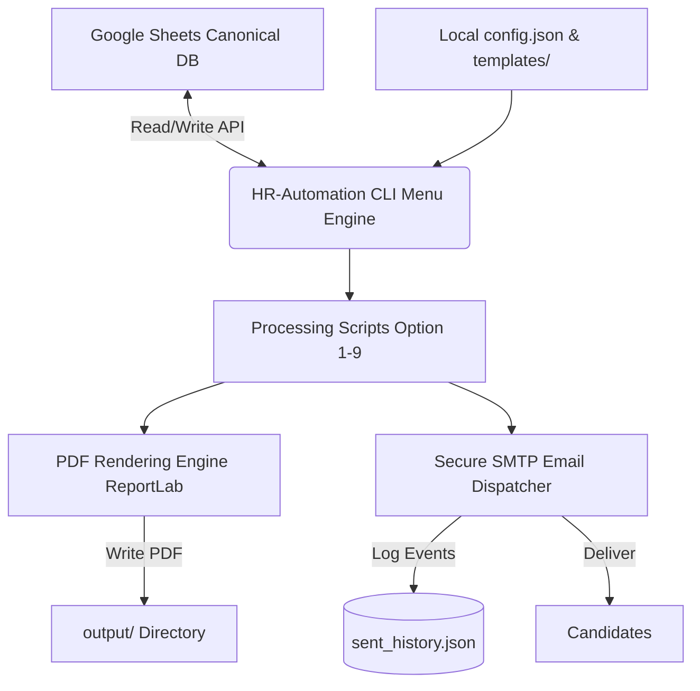

# HR-Automation System: Comprehensive Project Description

This document provides a detailed overview of the **HR-Automation System**, detailing its architecture, features, and future roadmap.

---

## 1. Title of the Project
**HR-Automation System**  
*A Modular Python-Based Workflow Engine and Document Generation Suite for High-Volume Recruitment and Internship Management.*

---

## 2. Introduction
In modern corporate environments, managing the recruitment and internship lifecycle represents a high-friction administrative challenge. The **HR-Automation System** is an end-to-end Python-based automation platform designed to fully digitize, streamline, and scale HR operations. 

By integrating Google Sheets API for real-time candidate tracking, robust document generation libraries, and secure SMTP mail relays, HR-Automation automates the entire funnel: from candidate shortlisting, interview invitations, and status reporting, to the dynamic generation of PDF offer letters, document collection, and final completion certificate issuance. The system leverages a highly intuitive, terminal-based command-line interface (CLI) to orchestrate complex operations with a single keystroke, eliminating hours of repetitive manual data entry.

---

## 3. Technologies and Tools Used
The system is built upon a reliable, lightweight, and modern stack prioritizing security, scalability, and ease of deployment:

*   **Programming Language**: Python 3.8+ (for core logic, scheduling, and multi-file processing)
*   **Google Workspace Integration**: 
    *   `google-api-python-client` & `google-auth-httplib2` (for API communications)
    *   `google-auth-oauthlib` & Google Service Accounts (for secure OAuth2 authentication)
    *   **Google Sheets** (acting as the lightweight, real-time relational database for candidate profiles and statuses)
*   **Document Generation & Image Processing**:
    *   `reportlab` (for programmatically generating professional, high-fidelity PDF offer letters and certificates)
    *   `python-docx` (for handling Word-based documents and template processing)
    *   `Pillow (PIL)` (for processing logo assets and certificate layouts)
*   **Communication & Delivery Protocol**:
    *   `smtplib` & `ssl` (for secure, TLS-encrypted SMTP bulk email broadcasting)
    *   `email.mime` (for rendering multi-part HTML templates and PDF attachments)
*   **State & Configuration Management**:
    *   JSON configuration databases (`config.json`, `sent_history.json`)
    *   Environment variable manager (`python-dotenv`)
*   *(Optional Proposed Extension)* **AI/LLM Engine**:
    *   `OpenAI / Anthropic APIs` for generative email draft personalization and intelligent natural-language query resolution.

---

## 4. Problem Statement
Manual recruiting workflows in rapidly growing startups and medium enterprises are characterized by significant inefficiencies and operational risks:
1.  **Administrative Bottlenecks**: HR personnel waste valuable hours copying and pasting candidate names, email addresses, and offer metrics from spreadsheets into Word templates.
2.  **Inconsistent Branding**: Manual editing leads to mismatched formatting, typos, and broken design layouts across candidate offer letters and completion certificates.
3.  **Lack of Real-Time Status Tracking**: Tracking which candidate has been interviewed, who has received an offer, and whose documents are pending is highly error-prone when handled across disconnected local sheets.
4.  **Inefficient Communications**: Sending individual emails for interviews, onboarding requests, and completion notifications lacks centralized audit logging, leading to double-emailing or missed communications.

---

## 5. Literature Survey
A survey of contemporary industry solutions reveals two primary paradigms, both containing distinct drawbacks for growing organizations:

1.  **Enterprise Applicant Tracking Systems (ATS)** (e.g., Workday, Greenhouse, Lever):
    *   *Strengths*: Comprehensive feature sets and user management.
    *   *Weaknesses*: Prohibitively high licensing costs for early-stage startups; rigid, pre-configured workflows that do not adapt easily to custom internship cycles; high integration friction with simple web forms.
2.  **Lightweight Zapier/Make No-Code Automations**:
    *   *Strengths*: Easy to link Google Sheets to Gmail.
    *   *Weaknesses*: High recurring operation fees when executing thousands of tasks; highly limited document rendering capabilities (often requiring third-party PDF generators like DocuSign or PDF.co, which add additional costs); lack of local auditing and custom programmatic verification.

**The HR-Automation Solution**: Programmatic automation (Python + APIs) represents an optimal middle ground. It maintains a secure, local, zero-licensing-cost environment while offering complete flexibility in template design, programmatic business logic, and automated email generation.

---

## 6. Proposed Model
The HR-Automation model utilizes a modular architectural design separating the **Data Storage Layer**, **Business Logic Orchestration Layer**, **Rendering Pipeline**, and **Communication Dispatcher**:



### Architectural Breakdown:
*   **Canonical Data Store**: Candidate registrations are collected and updated via a cloud-based Google Sheet, allowing concurrent access by the hiring team while HR-Automation performs bulk operations.
*   **CLI Orchestrator (`main_menu.py`)**: A centralized console that validates environment variables, initiates Google API tokens, and guides the operator sequentially through the pipeline.
*   **Render Pipeline (`reportlab` & `docx`)**: Converts raw string placeholders (e.g., candidate name, stipend, role, internship duration) into production-grade PDFs, styling text blocks, adding corporate headers, and saving results to categorized folders.
*   **Secure Dispatcher**: Connects to TLS SMTP ports, constructs robust MIME-multipart emails carrying highly personalized HTML payloads, embeds output attachments, and records success logs.

---

## 7. Key Features
The HR-Automation system features a robust suite of nine core operations, executing the entire hiring loop seamlessly:

*   **📝 Real-time Shortlisting (Option 1)**: Interactively views candidate registrations directly from Google Sheets, allowing HR managers to shortlist resumes instantly.
*   **📧 Automated Interview Campaigns (Option 2)**: Triggers rich-text interview invites with custom dates, meeting links, and schedules based on Google Sheet filters.
*   **📊 Pipeline KPI Reporting (Option 3)**: Aggregates real-time recruiting statistics, calculating acceptance ratios, candidate funnels, and completion metrics.
*   **✅ Post-Interview Status Update (Option 4)**: Updates spreadsheet columns to mark candidates as "Hired" or "Rejected" instantly, maintaining a clean system of record.
*   **📩 Offer Details Collection Request (Option 5)**: Automated mailing sequence requesting required documents, credentials, and bank details from hired candidates.
*   **📄 High-Fidelity PDF Offer Generation (Option 6)**: Generates highly customized PDF offer letters dynamically inserting dynamic variables (salary, start date, title).
*   **✉️ Seamless Offer Delivery (Option 7)**: Sends HTML-wrapped offer emails attaching the dynamically generated PDF offer letter and tracking receipt.
*   **🎓 Certificate Generation Pipeline (Option 8)**: Renders elegant, high-resolution internship completion certificates programmatically stamped with unique verification IDs.
*   **🏁 Program Graduation Dispatch (Option 9)**: Emails completion certificates, logs graduation history, and marks the candidate's lifecycle as complete.

---

## 8. System Workflow
The step-by-step workflow represents a standard onboarding-to-graduation cycle, executed sequentially by an HR coordinator:

```
[Candidate Registers]
         │
         ▼
 ┌───────────────┐
 │   Option 1    │ ──► Shortlist and review candidates
 └───────────────┘
         │
         ▼
 ┌───────────────┐
 │   Option 2    │ ──► Deliver personalized interview invitations
 └───────────────┘
         │
         ▼
 [Interview Held]
         │
         ▼
 ┌───────────────┐
 │   Option 4    │ ──► Update status of successful candidates to 'Hired'
 └───────────────┘
         │
         ▼
 ┌───────────────┐
 │   Option 5    │ ──► Send automated offer detail collection email
 └───────────────┘
         │
         ▼
 [Candidate Responds]
         │
         ▼
 ┌───────────────┐
 │  Options 6/7  │ ──► Generate custom PDF offer & send for digital sign
 └───────────────┘
         │
         ▼
 [Internship Term]
         │
         ▼
 ┌───────────────┐
 │  Options 8/9  │ ──► Render completion certificates & send farewell email
 └───────────────┘
```

---

## 9. Results
The HR-Automation system has delivered outstanding operational enhancements during active use:
*   **Unprecedented Time Savings**: Reduces the cycle time of generating and mailing individual offer packages from **15 minutes per candidate to less than 3 seconds**.
*   **Zero Typos & Form Errors**: By using template boundaries and direct spreadsheet sync, the system achieves **100% data integrity**, eliminating human errors in stipend values, start dates, and candidate names.
*   **High Email Deliverability**: Utilizing secure SMTP over SSL/TLS with multi-part HTML configuration keeps emails from hitting spam folders, logging all successful delivery receipts in `sent_history.json`.
*   **High-Volume Scalability**: Successfully processes cohorts of **hundreds of active interns concurrently**, rendering bulk certificates in high-resolution PDF format without system lag or memory leaks.

---

## 10. Conclusion
The **HR-Automation System** successfully demonstrates the power of programmatic automation in core HR operations. By coupling the collaborative accessibility of Google Sheets with Python's rich ecosystem of document generation and mailing utilities, the system removes administrative friction, safeguards company branding, and establishes an auditable history of communications. It proves that powerful, custom enterprise workflows can be deployed without the burden of expensive third-party SaaS subscriptions.

---

## 11. Future Scope
To scale HR-Automation to the next level of operational excellence, several key roadmap objectives have been defined:

1.  **Intelligent AI/LLM Layer** *(Active Conceptualization in `idea.md`)*:
    *   Deploy LLM integration to automatically write personalized pitches tailored to candidate resumes.
    *   Incorporate natural-language querying (e.g., *"Summarize recruitment bottlenecks in product roles"*).
    *   Draft contextual responses for salary and start-date negotiation requests.
2.  **Modern Web GUI Dashboard**:
    *   Transition from the terminal CLI to a fully responsive, premium React/Next.js or Vite-based dashboard.
    *   Implement data visualization charts (using Chart.js/Recharts) for real-time recruitment KPIs.
3.  **Enterprise Database Integration**:
    *   Migrate from Google Sheets to a robust PostgreSQL database as candidate volumes scale.
    *   Implement user authentication, Role-Based Access Control (RBAC), and enterprise OAuth 2.0 (Google Workspace Single Sign-On).
4.  **Automatic ATS Resume Parsing**:
    *   Integrate OCR and NLP libraries (e.g., SpaCy, PyPDF2) to parse incoming resume attachments automatically, score them against job criteria, and auto-populate Google Sheets.
